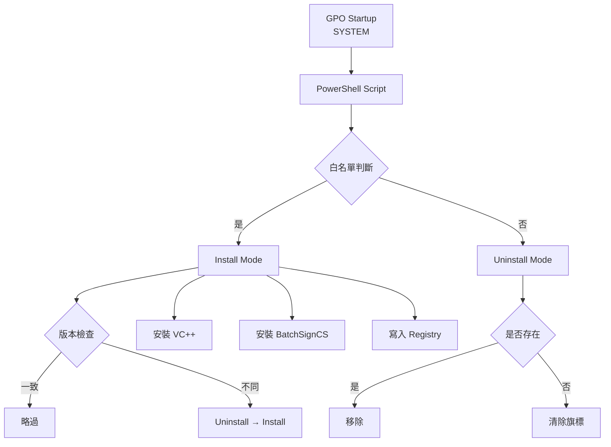

# 🚀 GEAS BatchSignCS 企業級部署框架

> Enterprise GPO Deployment + Endpoint State Enforcement + DryRun Simulation

---

## 📌 專案簡介

本專案提供一套 **企業級端點配置管理框架（Endpoint Configuration Engine）**，
透過 GPO Startup Script 自動管理「三代簽章元件（BatchSignCS）」。

### 🎯 目標

- ✅ 自動安裝 / 卸載
- ✅ 白名單控管（未授權設備自動移除）
- ✅ 版本升級（自動修正）
- ✅ HASH 防重複下載
- ✅ DryRun 模擬驗證
- ✅ 中央化日誌

---

## 🧠 架構設計



---

## 🔄 運作流程

### ✅ 模式控制

| 條件 | 行為 |
|------|------|
| 在白名單 | Install |
| 不在白名單 | Uninstall |

---

### ✅ 版本控制

```
版本一致 → 略過
版本不一致 → 自動升級
```

---

## 📦 安裝策略

### 本機快取

```
D:\Temp
```

### HASH 驗證

- SHA256
- 防止重複下載

---

## 🧾 Registry 管理

```
HKLM\SOFTWARE\Company\GEAS
```

| Key | 說明 |
|-----|------|
| BatchSignCS | 安裝旗標 |
| Version | 版本 |
| InstallDate | 安裝時間 |

---

## ⚠️ 安裝限制

BatchSignCS 為 InstallShield MSI：

| 項目 | 支援 |
|------|------|
| /qn | ❌ |
| /qb | ✅ |

---

## 🧪 DryRun 模式

```
-Mode DryRun
```

### 功能

- 模擬所有流程
- 不修改系統
- 全程記錄

---

## 🗂 日誌

### 本機

```
D:\Temp\GEAS_yyyyMMdd.log
```

### NAS

```
\NAS\LogFiles\GEAS
```

---

## 🚀 使用方式

### Install

```powershell
-Mode Install
```

### Uninstall

```powershell
-Mode Uninstall
```

### DryRun

```powershell
-Mode DryRun
```

---

## ✅ 系統能力

| 功能 | 狀態 |
|------|------|
| Install | ✅ |
| Uninstall | ✅ |
| Auto Upgrade | ✅ |
| Drift Control | ✅ |
| Logging | ✅ |
| DryRun | ✅ |

---

## 📌 版本

```
2026.05.13 Enterprise Stable v1.0
```

---

## 🚀 專案定位

> Endpoint Desired State Controller

---

## ⭐ 未來規劃

- AD Group 控管
- Dashboard 分析
- CI/CD
- Rollback

---

🚀 Enterprise GPO Deployment + State Enforcement
